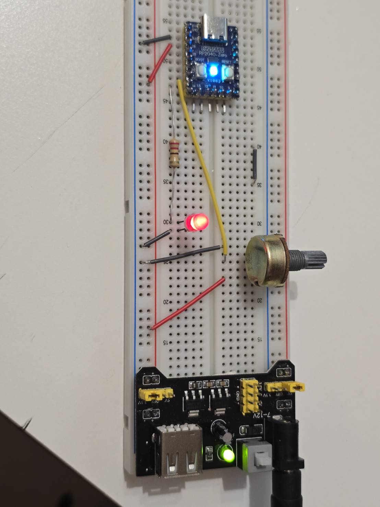
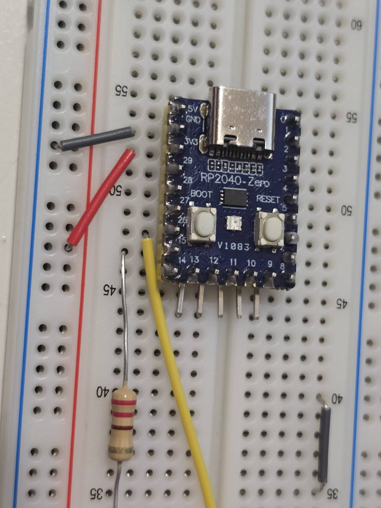

# RP2040 Embassy Demo

Rust Embassy example for an RP2040 Pico Zero / Waveshare RP2040-Zero style board.

The firmware reads a WL 10K potentiometer on `GP26 / ADC0`, drives an external LED on `GP15` with PWM brightness, and uses the board WS2812 RGB LED on `GPIO16` as a blink-speed indicator.

## Hardware

### Board

- MCU: RP2040
- BOOTSEL USB VID:PID: `2e8a:0003`
- Boot drive: `RPI-RP2`
- Board LED: WS2812 RGB LED on `GPIO16`
- Flash size observed by `picotool`: `2048K`

### Wiring

| Pico Zero pin | Component | Purpose |
| --- | --- | --- |
| `3V3` | WL 10K potentiometer one side | ADC high reference |
| `GND` | WL 10K potentiometer other side | ADC low reference |
| `GP26 / ADC0` | WL 10K potentiometer center pin | Analog voltage input |
| `GP15` | `220R` to `330R` resistor, then LED anode | External LED PWM output |
| `GND` | LED cathode | External LED ground |
| `GPIO16` | On-board WS2812 | Board status LED, already wired on the board |

Do not connect 5V to `GP26 / ADC0`. RP2040 ADC pins are 3.3V max.

### Physical Wiring Photos

Photo 1 shows the complete breadboard setup: RP2040-Zero on the top breadboard area, the WL 10K potentiometer on the right side, the external red LED and current-limiting resistor in the middle, and the breadboard power module at the bottom.



Photo 2 is a close-up of the RP2040-Zero wiring area. The board's on-board WS2812 RGB LED is the small square LED near the center of the board and is controlled by firmware through `GPIO16`. The external LED path remains separate and is driven from `GP15`.



實體接線重點：

- 可變電阻中腳接到 `GP26 / ADC0`，用來讀取旋鈕位置。
- 可變電阻兩側分別接 `3V3` 與 `GND`；如果旋轉方向和預期相反，交換兩側即可。
- 外接紅色 LED 必須串聯 `220R` 到 `330R` 限流電阻，再接到 `GP15`。
- 外接 LED 負極接 `GND`。
- 板子中央的 RGB LED 是板載 WS2812，不需要額外接線，由 `GPIO16` 控制。

## Firmware Behavior

The firmware is built with `embassy-rs`.

- Main async task:
  - Reads `GP26 / ADC0` every 10 ms.
  - Stores the latest ADC value in an `AtomicU16`.
  - Sets `GP15` PWM duty cycle from `0..4095`.

- Board LED async task:
  - Reads the latest ADC value.
  - Blinks the on-board WS2812 on `GPIO16`.
  - Higher ADC value means faster blink.
  - Color also changes by range.

ADC ranges:

| ADC value | External LED | Board LED color | Board LED blink |
| --- | --- | --- | --- |
| `0..819` | Very dim | Blue | Slow |
| `820..1638` | Low | Cyan | Medium slow |
| `1639..2457` | Medium | Green | Medium |
| `2458..3276` | High | Amber | Fast |
| `3277..4095` | Bright | Red | Very fast |

## Project Layout

```text
.
├── .cargo/config.toml      # thumbv6m target and RP2040 linker flags
├── Cargo.toml              # Embassy RP2040 dependencies
├── docs/images/            # Physical wiring photos
├── flash.sh                # Build and flash helper
├── memory.x                # RP2040 memory map
├── src/main.rs             # Embassy firmware
└── wl10k_led_pico zero.html
```

## Requirements

Installed Rust target:

```bash
rustup target add thumbv6m-none-eabi
```

Required tools:

```bash
cargo install elf2uf2-rs
cargo install flip-link
```

Optional tools:

```bash
cargo install probe-rs-tools
```

This project uses Bash for build and flash commands. On Windows, Git Bash / MSYS Bash is expected.

## Build

```bash
bash flash.sh build
```

Output UF2:

```text
target/thumbv6m-none-eabi/release/rp2040-embassy-demo.uf2
```

## Flash

Put the board into BOOTSEL mode:

1. Hold `BOOTSEL`.
2. Plug in USB.
3. Release `BOOTSEL`.
4. Confirm the `RPI-RP2` drive appears.

Flash automatically:

```bash
bash flash.sh
```

Flash only by UF2 drive copy:

```bash
bash flash.sh uf2
```

Flash with `picotool`:

```bash
bash flash.sh picotool
```

Probe board state:

```bash
bash flash.sh probe
```

Expected BOOTSEL probe includes:

```text
2e8a:0003  USB Mass Storage Device, RP2 Boot
Board:     RP2040 BOOTSEL (Pi Pico)
Chip:      RP2040
```

## Development Notes

Important pins in `src/main.rs`:

```rust
Channel::new_pin(p.PIN_26, Pull::None);       // Potentiometer ADC input
Pwm::new_output_b(p.PWM_SLICE7, p.PIN_15, _); // External LED PWM
PioWs2812::new(..., p.PIN_16, ...);           // On-board WS2812 RGB LED
```

`GP15` is PWM slice 7 channel B, so the code uses `Pwm::new_output_b(p.PWM_SLICE7, p.PIN_15, ...)`.

The on-board WS2812 uses PIO0 state machine 0 and DMA channel 0:

```rust
PIO0_IRQ_0 => pio::InterruptHandler<peripherals::PIO0>;
DMA_IRQ_0 => dma::InterruptHandler<peripherals::DMA_CH0>;
```

## Troubleshooting

If flashing fails because no RPI-RP2 drive is found, reconnect the board while holding `BOOTSEL`.

If the external LED does not change brightness:

- Check that the LED has a `220R` to `330R` series resistor.
- Check LED polarity.
- Check that the LED anode is connected to `GP15` through the resistor.
- Check that the LED cathode is connected to `GND`.

If the ADC reading appears inverted, swap the two outside pins of the potentiometer. The center pin must stay on `GP26 / ADC0`.

If the board LED does not blink, confirm the board is an RP2040-Zero style board with WS2812 on `GPIO16`. A standard Raspberry Pi Pico has a simple LED on `GP25`, not WS2812 on `GPIO16`.
